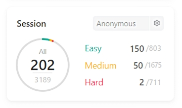

<!---LeetCode Topics Start-->
# LeetCode Topics
## Linked List
|  |
| ------- |
| [0023-merge-k-sorted-lists](https://github.com/100baek-go/leetcode/tree/master/0023-merge-k-sorted-lists) |
| [0082-remove-duplicates-from-sorted-list-ii](https://github.com/100baek-go/leetcode/tree/master/0082-remove-duplicates-from-sorted-list-ii) |
| [0086-partition-list](https://github.com/100baek-go/leetcode/tree/master/0086-partition-list) |
| [0092-reverse-linked-list-ii](https://github.com/100baek-go/leetcode/tree/master/0092-reverse-linked-list-ii) |
| [0109-convert-sorted-list-to-binary-search-tree](https://github.com/100baek-go/leetcode/tree/master/0109-convert-sorted-list-to-binary-search-tree) |
| [0114-flatten-binary-tree-to-linked-list](https://github.com/100baek-go/leetcode/tree/master/0114-flatten-binary-tree-to-linked-list) |
| [0116-populating-next-right-pointers-in-each-node](https://github.com/100baek-go/leetcode/tree/master/0116-populating-next-right-pointers-in-each-node) |
| [0117-populating-next-right-pointers-in-each-node-ii](https://github.com/100baek-go/leetcode/tree/master/0117-populating-next-right-pointers-in-each-node-ii) |
| [0138-copy-list-with-random-pointer](https://github.com/100baek-go/leetcode/tree/master/0138-copy-list-with-random-pointer) |
| [0142-linked-list-cycle-ii](https://github.com/100baek-go/leetcode/tree/master/0142-linked-list-cycle-ii) |
| [0143-reorder-list](https://github.com/100baek-go/leetcode/tree/master/0143-reorder-list) |
| [0705-design-hashset](https://github.com/100baek-go/leetcode/tree/master/0705-design-hashset) |
| [0706-design-hashmap](https://github.com/100baek-go/leetcode/tree/master/0706-design-hashmap) |
| [0876-middle-of-the-linked-list](https://github.com/100baek-go/leetcode/tree/master/0876-middle-of-the-linked-list) |
## Divide and Conquer
|  |
| ------- |
| [0023-merge-k-sorted-lists](https://github.com/100baek-go/leetcode/tree/master/0023-merge-k-sorted-lists) |
| [0106-construct-binary-tree-from-inorder-and-postorder-traversal](https://github.com/100baek-go/leetcode/tree/master/0106-construct-binary-tree-from-inorder-and-postorder-traversal) |
| [0109-convert-sorted-list-to-binary-search-tree](https://github.com/100baek-go/leetcode/tree/master/0109-convert-sorted-list-to-binary-search-tree) |
## Heap (Priority Queue)
|  |
| ------- |
| [0023-merge-k-sorted-lists](https://github.com/100baek-go/leetcode/tree/master/0023-merge-k-sorted-lists) |
| [0703-kth-largest-element-in-a-stream](https://github.com/100baek-go/leetcode/tree/master/0703-kth-largest-element-in-a-stream) |
## Merge Sort
|  |
| ------- |
| [0023-merge-k-sorted-lists](https://github.com/100baek-go/leetcode/tree/master/0023-merge-k-sorted-lists) |
## Two Pointers
|  |
| ------- |
| [0082-remove-duplicates-from-sorted-list-ii](https://github.com/100baek-go/leetcode/tree/master/0082-remove-duplicates-from-sorted-list-ii) |
| [0086-partition-list](https://github.com/100baek-go/leetcode/tree/master/0086-partition-list) |
| [0142-linked-list-cycle-ii](https://github.com/100baek-go/leetcode/tree/master/0142-linked-list-cycle-ii) |
| [0143-reorder-list](https://github.com/100baek-go/leetcode/tree/master/0143-reorder-list) |
| [0821-shortest-distance-to-a-character](https://github.com/100baek-go/leetcode/tree/master/0821-shortest-distance-to-a-character) |
| [0832-flipping-an-image](https://github.com/100baek-go/leetcode/tree/master/0832-flipping-an-image) |
| [0844-backspace-string-compare](https://github.com/100baek-go/leetcode/tree/master/0844-backspace-string-compare) |
| [0876-middle-of-the-linked-list](https://github.com/100baek-go/leetcode/tree/master/0876-middle-of-the-linked-list) |
| [0905-sort-array-by-parity](https://github.com/100baek-go/leetcode/tree/master/0905-sort-array-by-parity) |
| [0917-reverse-only-letters](https://github.com/100baek-go/leetcode/tree/master/0917-reverse-only-letters) |
| [0922-sort-array-by-parity-ii](https://github.com/100baek-go/leetcode/tree/master/0922-sort-array-by-parity-ii) |
| [0925-long-pressed-name](https://github.com/100baek-go/leetcode/tree/master/0925-long-pressed-name) |
## Math
|  |
| ------- |
| [0089-gray-code](https://github.com/100baek-go/leetcode/tree/master/0089-gray-code) |
| [0096-unique-binary-search-trees](https://github.com/100baek-go/leetcode/tree/master/0096-unique-binary-search-trees) |
| [0728-self-dividing-numbers](https://github.com/100baek-go/leetcode/tree/master/0728-self-dividing-numbers) |
| [0762-prime-number-of-set-bits-in-binary-representation](https://github.com/100baek-go/leetcode/tree/master/0762-prime-number-of-set-bits-in-binary-representation) |
| [0812-largest-triangle-area](https://github.com/100baek-go/leetcode/tree/master/0812-largest-triangle-area) |
| [0836-rectangle-overlap](https://github.com/100baek-go/leetcode/tree/master/0836-rectangle-overlap) |
| [0883-projection-area-of-3d-shapes](https://github.com/100baek-go/leetcode/tree/master/0883-projection-area-of-3d-shapes) |
| [0892-surface-area-of-3d-shapes](https://github.com/100baek-go/leetcode/tree/master/0892-surface-area-of-3d-shapes) |
| [0908-smallest-range-i](https://github.com/100baek-go/leetcode/tree/master/0908-smallest-range-i) |
| [0914-x-of-a-kind-in-a-deck-of-cards](https://github.com/100baek-go/leetcode/tree/master/0914-x-of-a-kind-in-a-deck-of-cards) |
## Backtracking
|  |
| ------- |
| [0089-gray-code](https://github.com/100baek-go/leetcode/tree/master/0089-gray-code) |
| [0090-subsets-ii](https://github.com/100baek-go/leetcode/tree/master/0090-subsets-ii) |
| [0093-restore-ip-addresses](https://github.com/100baek-go/leetcode/tree/master/0093-restore-ip-addresses) |
| [0095-unique-binary-search-trees-ii](https://github.com/100baek-go/leetcode/tree/master/0095-unique-binary-search-trees-ii) |
| [0113-path-sum-ii](https://github.com/100baek-go/leetcode/tree/master/0113-path-sum-ii) |
| [0131-palindrome-partitioning](https://github.com/100baek-go/leetcode/tree/master/0131-palindrome-partitioning) |
## Bit Manipulation
|  |
| ------- |
| [0089-gray-code](https://github.com/100baek-go/leetcode/tree/master/0089-gray-code) |
| [0090-subsets-ii](https://github.com/100baek-go/leetcode/tree/master/0090-subsets-ii) |
| [0137-single-number-ii](https://github.com/100baek-go/leetcode/tree/master/0137-single-number-ii) |
| [0762-prime-number-of-set-bits-in-binary-representation](https://github.com/100baek-go/leetcode/tree/master/0762-prime-number-of-set-bits-in-binary-representation) |
| [0832-flipping-an-image](https://github.com/100baek-go/leetcode/tree/master/0832-flipping-an-image) |
| [0868-binary-gap](https://github.com/100baek-go/leetcode/tree/master/0868-binary-gap) |
## Array
|  |
| ------- |
| [0090-subsets-ii](https://github.com/100baek-go/leetcode/tree/master/0090-subsets-ii) |
| [0106-construct-binary-tree-from-inorder-and-postorder-traversal](https://github.com/100baek-go/leetcode/tree/master/0106-construct-binary-tree-from-inorder-and-postorder-traversal) |
| [0120-triangle](https://github.com/100baek-go/leetcode/tree/master/0120-triangle) |
| [0122-best-time-to-buy-and-sell-stock-ii](https://github.com/100baek-go/leetcode/tree/master/0122-best-time-to-buy-and-sell-stock-ii) |
| [0128-longest-consecutive-sequence](https://github.com/100baek-go/leetcode/tree/master/0128-longest-consecutive-sequence) |
| [0130-surrounded-regions](https://github.com/100baek-go/leetcode/tree/master/0130-surrounded-regions) |
| [0134-gas-station](https://github.com/100baek-go/leetcode/tree/master/0134-gas-station) |
| [0137-single-number-ii](https://github.com/100baek-go/leetcode/tree/master/0137-single-number-ii) |
| [0139-word-break](https://github.com/100baek-go/leetcode/tree/master/0139-word-break) |
| [0704-binary-search](https://github.com/100baek-go/leetcode/tree/master/0704-binary-search) |
| [0705-design-hashset](https://github.com/100baek-go/leetcode/tree/master/0705-design-hashset) |
| [0706-design-hashmap](https://github.com/100baek-go/leetcode/tree/master/0706-design-hashmap) |
| [0717-1-bit-and-2-bit-characters](https://github.com/100baek-go/leetcode/tree/master/0717-1-bit-and-2-bit-characters) |
| [0724-find-pivot-index](https://github.com/100baek-go/leetcode/tree/master/0724-find-pivot-index) |
| [0733-flood-fill](https://github.com/100baek-go/leetcode/tree/master/0733-flood-fill) |
| [0744-find-smallest-letter-greater-than-target](https://github.com/100baek-go/leetcode/tree/master/0744-find-smallest-letter-greater-than-target) |
| [0746-min-cost-climbing-stairs](https://github.com/100baek-go/leetcode/tree/master/0746-min-cost-climbing-stairs) |
| [0747-largest-number-at-least-twice-of-others](https://github.com/100baek-go/leetcode/tree/master/0747-largest-number-at-least-twice-of-others) |
| [0748-shortest-completing-word](https://github.com/100baek-go/leetcode/tree/master/0748-shortest-completing-word) |
| [0766-toeplitz-matrix](https://github.com/100baek-go/leetcode/tree/master/0766-toeplitz-matrix) |
| [0804-unique-morse-code-words](https://github.com/100baek-go/leetcode/tree/master/0804-unique-morse-code-words) |
| [0806-number-of-lines-to-write-string](https://github.com/100baek-go/leetcode/tree/master/0806-number-of-lines-to-write-string) |
| [0812-largest-triangle-area](https://github.com/100baek-go/leetcode/tree/master/0812-largest-triangle-area) |
| [0819-most-common-word](https://github.com/100baek-go/leetcode/tree/master/0819-most-common-word) |
| [0821-shortest-distance-to-a-character](https://github.com/100baek-go/leetcode/tree/master/0821-shortest-distance-to-a-character) |
| [0832-flipping-an-image](https://github.com/100baek-go/leetcode/tree/master/0832-flipping-an-image) |
| [0860-lemonade-change](https://github.com/100baek-go/leetcode/tree/master/0860-lemonade-change) |
| [0867-transpose-matrix](https://github.com/100baek-go/leetcode/tree/master/0867-transpose-matrix) |
| [0883-projection-area-of-3d-shapes](https://github.com/100baek-go/leetcode/tree/master/0883-projection-area-of-3d-shapes) |
| [0888-fair-candy-swap](https://github.com/100baek-go/leetcode/tree/master/0888-fair-candy-swap) |
| [0892-surface-area-of-3d-shapes](https://github.com/100baek-go/leetcode/tree/master/0892-surface-area-of-3d-shapes) |
| [0896-monotonic-array](https://github.com/100baek-go/leetcode/tree/master/0896-monotonic-array) |
| [0905-sort-array-by-parity](https://github.com/100baek-go/leetcode/tree/master/0905-sort-array-by-parity) |
| [0908-smallest-range-i](https://github.com/100baek-go/leetcode/tree/master/0908-smallest-range-i) |
| [0914-x-of-a-kind-in-a-deck-of-cards](https://github.com/100baek-go/leetcode/tree/master/0914-x-of-a-kind-in-a-deck-of-cards) |
| [0922-sort-array-by-parity-ii](https://github.com/100baek-go/leetcode/tree/master/0922-sort-array-by-parity-ii) |
| [0929-unique-email-addresses](https://github.com/100baek-go/leetcode/tree/master/0929-unique-email-addresses) |
## String
|  |
| ------- |
| [0091-decode-ways](https://github.com/100baek-go/leetcode/tree/master/0091-decode-ways) |
| [0093-restore-ip-addresses](https://github.com/100baek-go/leetcode/tree/master/0093-restore-ip-addresses) |
| [0097-interleaving-string](https://github.com/100baek-go/leetcode/tree/master/0097-interleaving-string) |
| [0131-palindrome-partitioning](https://github.com/100baek-go/leetcode/tree/master/0131-palindrome-partitioning) |
| [0139-word-break](https://github.com/100baek-go/leetcode/tree/master/0139-word-break) |
| [0709-to-lower-case](https://github.com/100baek-go/leetcode/tree/master/0709-to-lower-case) |
| [0748-shortest-completing-word](https://github.com/100baek-go/leetcode/tree/master/0748-shortest-completing-word) |
| [0771-jewels-and-stones](https://github.com/100baek-go/leetcode/tree/master/0771-jewels-and-stones) |
| [0796-rotate-string](https://github.com/100baek-go/leetcode/tree/master/0796-rotate-string) |
| [0804-unique-morse-code-words](https://github.com/100baek-go/leetcode/tree/master/0804-unique-morse-code-words) |
| [0806-number-of-lines-to-write-string](https://github.com/100baek-go/leetcode/tree/master/0806-number-of-lines-to-write-string) |
| [0819-most-common-word](https://github.com/100baek-go/leetcode/tree/master/0819-most-common-word) |
| [0821-shortest-distance-to-a-character](https://github.com/100baek-go/leetcode/tree/master/0821-shortest-distance-to-a-character) |
| [0824-goat-latin](https://github.com/100baek-go/leetcode/tree/master/0824-goat-latin) |
| [0830-positions-of-large-groups](https://github.com/100baek-go/leetcode/tree/master/0830-positions-of-large-groups) |
| [0844-backspace-string-compare](https://github.com/100baek-go/leetcode/tree/master/0844-backspace-string-compare) |
| [0859-buddy-strings](https://github.com/100baek-go/leetcode/tree/master/0859-buddy-strings) |
| [0884-uncommon-words-from-two-sentences](https://github.com/100baek-go/leetcode/tree/master/0884-uncommon-words-from-two-sentences) |
| [0917-reverse-only-letters](https://github.com/100baek-go/leetcode/tree/master/0917-reverse-only-letters) |
| [0925-long-pressed-name](https://github.com/100baek-go/leetcode/tree/master/0925-long-pressed-name) |
| [0929-unique-email-addresses](https://github.com/100baek-go/leetcode/tree/master/0929-unique-email-addresses) |
## Dynamic Programming
|  |
| ------- |
| [0091-decode-ways](https://github.com/100baek-go/leetcode/tree/master/0091-decode-ways) |
| [0095-unique-binary-search-trees-ii](https://github.com/100baek-go/leetcode/tree/master/0095-unique-binary-search-trees-ii) |
| [0096-unique-binary-search-trees](https://github.com/100baek-go/leetcode/tree/master/0096-unique-binary-search-trees) |
| [0097-interleaving-string](https://github.com/100baek-go/leetcode/tree/master/0097-interleaving-string) |
| [0120-triangle](https://github.com/100baek-go/leetcode/tree/master/0120-triangle) |
| [0122-best-time-to-buy-and-sell-stock-ii](https://github.com/100baek-go/leetcode/tree/master/0122-best-time-to-buy-and-sell-stock-ii) |
| [0131-palindrome-partitioning](https://github.com/100baek-go/leetcode/tree/master/0131-palindrome-partitioning) |
| [0139-word-break](https://github.com/100baek-go/leetcode/tree/master/0139-word-break) |
| [0746-min-cost-climbing-stairs](https://github.com/100baek-go/leetcode/tree/master/0746-min-cost-climbing-stairs) |
## Tree
|  |
| ------- |
| [0095-unique-binary-search-trees-ii](https://github.com/100baek-go/leetcode/tree/master/0095-unique-binary-search-trees-ii) |
| [0096-unique-binary-search-trees](https://github.com/100baek-go/leetcode/tree/master/0096-unique-binary-search-trees) |
| [0098-validate-binary-search-tree](https://github.com/100baek-go/leetcode/tree/master/0098-validate-binary-search-tree) |
| [0099-recover-binary-search-tree](https://github.com/100baek-go/leetcode/tree/master/0099-recover-binary-search-tree) |
| [0102-binary-tree-level-order-traversal](https://github.com/100baek-go/leetcode/tree/master/0102-binary-tree-level-order-traversal) |
| [0103-binary-tree-zigzag-level-order-traversal](https://github.com/100baek-go/leetcode/tree/master/0103-binary-tree-zigzag-level-order-traversal) |
| [0106-construct-binary-tree-from-inorder-and-postorder-traversal](https://github.com/100baek-go/leetcode/tree/master/0106-construct-binary-tree-from-inorder-and-postorder-traversal) |
| [0107-binary-tree-level-order-traversal-ii](https://github.com/100baek-go/leetcode/tree/master/0107-binary-tree-level-order-traversal-ii) |
| [0109-convert-sorted-list-to-binary-search-tree](https://github.com/100baek-go/leetcode/tree/master/0109-convert-sorted-list-to-binary-search-tree) |
| [0113-path-sum-ii](https://github.com/100baek-go/leetcode/tree/master/0113-path-sum-ii) |
| [0114-flatten-binary-tree-to-linked-list](https://github.com/100baek-go/leetcode/tree/master/0114-flatten-binary-tree-to-linked-list) |
| [0116-populating-next-right-pointers-in-each-node](https://github.com/100baek-go/leetcode/tree/master/0116-populating-next-right-pointers-in-each-node) |
| [0117-populating-next-right-pointers-in-each-node-ii](https://github.com/100baek-go/leetcode/tree/master/0117-populating-next-right-pointers-in-each-node-ii) |
| [0129-sum-root-to-leaf-numbers](https://github.com/100baek-go/leetcode/tree/master/0129-sum-root-to-leaf-numbers) |
| [0703-kth-largest-element-in-a-stream](https://github.com/100baek-go/leetcode/tree/master/0703-kth-largest-element-in-a-stream) |
| [0783-minimum-distance-between-bst-nodes](https://github.com/100baek-go/leetcode/tree/master/0783-minimum-distance-between-bst-nodes) |
| [0872-leaf-similar-trees](https://github.com/100baek-go/leetcode/tree/master/0872-leaf-similar-trees) |
| [0897-increasing-order-search-tree](https://github.com/100baek-go/leetcode/tree/master/0897-increasing-order-search-tree) |
| [0938-range-sum-of-bst](https://github.com/100baek-go/leetcode/tree/master/0938-range-sum-of-bst) |
## Binary Search Tree
|  |
| ------- |
| [0095-unique-binary-search-trees-ii](https://github.com/100baek-go/leetcode/tree/master/0095-unique-binary-search-trees-ii) |
| [0096-unique-binary-search-trees](https://github.com/100baek-go/leetcode/tree/master/0096-unique-binary-search-trees) |
| [0098-validate-binary-search-tree](https://github.com/100baek-go/leetcode/tree/master/0098-validate-binary-search-tree) |
| [0099-recover-binary-search-tree](https://github.com/100baek-go/leetcode/tree/master/0099-recover-binary-search-tree) |
| [0109-convert-sorted-list-to-binary-search-tree](https://github.com/100baek-go/leetcode/tree/master/0109-convert-sorted-list-to-binary-search-tree) |
| [0703-kth-largest-element-in-a-stream](https://github.com/100baek-go/leetcode/tree/master/0703-kth-largest-element-in-a-stream) |
| [0704-binary-search](https://github.com/100baek-go/leetcode/tree/master/0704-binary-search) |
| [0744-find-smallest-letter-greater-than-target](https://github.com/100baek-go/leetcode/tree/master/0744-find-smallest-letter-greater-than-target) |
| [0783-minimum-distance-between-bst-nodes](https://github.com/100baek-go/leetcode/tree/master/0783-minimum-distance-between-bst-nodes) |
| [0888-fair-candy-swap](https://github.com/100baek-go/leetcode/tree/master/0888-fair-candy-swap) |
| [0897-increasing-order-search-tree](https://github.com/100baek-go/leetcode/tree/master/0897-increasing-order-search-tree) |
| [0938-range-sum-of-bst](https://github.com/100baek-go/leetcode/tree/master/0938-range-sum-of-bst) |
## Binary Tree
|  |
| ------- |
| [0095-unique-binary-search-trees-ii](https://github.com/100baek-go/leetcode/tree/master/0095-unique-binary-search-trees-ii) |
| [0096-unique-binary-search-trees](https://github.com/100baek-go/leetcode/tree/master/0096-unique-binary-search-trees) |
| [0098-validate-binary-search-tree](https://github.com/100baek-go/leetcode/tree/master/0098-validate-binary-search-tree) |
| [0099-recover-binary-search-tree](https://github.com/100baek-go/leetcode/tree/master/0099-recover-binary-search-tree) |
| [0102-binary-tree-level-order-traversal](https://github.com/100baek-go/leetcode/tree/master/0102-binary-tree-level-order-traversal) |
| [0103-binary-tree-zigzag-level-order-traversal](https://github.com/100baek-go/leetcode/tree/master/0103-binary-tree-zigzag-level-order-traversal) |
| [0106-construct-binary-tree-from-inorder-and-postorder-traversal](https://github.com/100baek-go/leetcode/tree/master/0106-construct-binary-tree-from-inorder-and-postorder-traversal) |
| [0107-binary-tree-level-order-traversal-ii](https://github.com/100baek-go/leetcode/tree/master/0107-binary-tree-level-order-traversal-ii) |
| [0109-convert-sorted-list-to-binary-search-tree](https://github.com/100baek-go/leetcode/tree/master/0109-convert-sorted-list-to-binary-search-tree) |
| [0113-path-sum-ii](https://github.com/100baek-go/leetcode/tree/master/0113-path-sum-ii) |
| [0114-flatten-binary-tree-to-linked-list](https://github.com/100baek-go/leetcode/tree/master/0114-flatten-binary-tree-to-linked-list) |
| [0116-populating-next-right-pointers-in-each-node](https://github.com/100baek-go/leetcode/tree/master/0116-populating-next-right-pointers-in-each-node) |
| [0117-populating-next-right-pointers-in-each-node-ii](https://github.com/100baek-go/leetcode/tree/master/0117-populating-next-right-pointers-in-each-node-ii) |
| [0129-sum-root-to-leaf-numbers](https://github.com/100baek-go/leetcode/tree/master/0129-sum-root-to-leaf-numbers) |
| [0703-kth-largest-element-in-a-stream](https://github.com/100baek-go/leetcode/tree/master/0703-kth-largest-element-in-a-stream) |
| [0783-minimum-distance-between-bst-nodes](https://github.com/100baek-go/leetcode/tree/master/0783-minimum-distance-between-bst-nodes) |
| [0872-leaf-similar-trees](https://github.com/100baek-go/leetcode/tree/master/0872-leaf-similar-trees) |
| [0897-increasing-order-search-tree](https://github.com/100baek-go/leetcode/tree/master/0897-increasing-order-search-tree) |
| [0938-range-sum-of-bst](https://github.com/100baek-go/leetcode/tree/master/0938-range-sum-of-bst) |
## Depth-First Search
|  |
| ------- |
| [0098-validate-binary-search-tree](https://github.com/100baek-go/leetcode/tree/master/0098-validate-binary-search-tree) |
| [0099-recover-binary-search-tree](https://github.com/100baek-go/leetcode/tree/master/0099-recover-binary-search-tree) |
| [0113-path-sum-ii](https://github.com/100baek-go/leetcode/tree/master/0113-path-sum-ii) |
| [0114-flatten-binary-tree-to-linked-list](https://github.com/100baek-go/leetcode/tree/master/0114-flatten-binary-tree-to-linked-list) |
| [0116-populating-next-right-pointers-in-each-node](https://github.com/100baek-go/leetcode/tree/master/0116-populating-next-right-pointers-in-each-node) |
| [0117-populating-next-right-pointers-in-each-node-ii](https://github.com/100baek-go/leetcode/tree/master/0117-populating-next-right-pointers-in-each-node-ii) |
| [0129-sum-root-to-leaf-numbers](https://github.com/100baek-go/leetcode/tree/master/0129-sum-root-to-leaf-numbers) |
| [0130-surrounded-regions](https://github.com/100baek-go/leetcode/tree/master/0130-surrounded-regions) |
| [0133-clone-graph](https://github.com/100baek-go/leetcode/tree/master/0133-clone-graph) |
| [0733-flood-fill](https://github.com/100baek-go/leetcode/tree/master/0733-flood-fill) |
| [0783-minimum-distance-between-bst-nodes](https://github.com/100baek-go/leetcode/tree/master/0783-minimum-distance-between-bst-nodes) |
| [0872-leaf-similar-trees](https://github.com/100baek-go/leetcode/tree/master/0872-leaf-similar-trees) |
| [0897-increasing-order-search-tree](https://github.com/100baek-go/leetcode/tree/master/0897-increasing-order-search-tree) |
| [0938-range-sum-of-bst](https://github.com/100baek-go/leetcode/tree/master/0938-range-sum-of-bst) |
## Breadth-First Search
|  |
| ------- |
| [0102-binary-tree-level-order-traversal](https://github.com/100baek-go/leetcode/tree/master/0102-binary-tree-level-order-traversal) |
| [0103-binary-tree-zigzag-level-order-traversal](https://github.com/100baek-go/leetcode/tree/master/0103-binary-tree-zigzag-level-order-traversal) |
| [0107-binary-tree-level-order-traversal-ii](https://github.com/100baek-go/leetcode/tree/master/0107-binary-tree-level-order-traversal-ii) |
| [0116-populating-next-right-pointers-in-each-node](https://github.com/100baek-go/leetcode/tree/master/0116-populating-next-right-pointers-in-each-node) |
| [0117-populating-next-right-pointers-in-each-node-ii](https://github.com/100baek-go/leetcode/tree/master/0117-populating-next-right-pointers-in-each-node-ii) |
| [0130-surrounded-regions](https://github.com/100baek-go/leetcode/tree/master/0130-surrounded-regions) |
| [0133-clone-graph](https://github.com/100baek-go/leetcode/tree/master/0133-clone-graph) |
| [0733-flood-fill](https://github.com/100baek-go/leetcode/tree/master/0733-flood-fill) |
| [0783-minimum-distance-between-bst-nodes](https://github.com/100baek-go/leetcode/tree/master/0783-minimum-distance-between-bst-nodes) |
## Hash Table
|  |
| ------- |
| [0106-construct-binary-tree-from-inorder-and-postorder-traversal](https://github.com/100baek-go/leetcode/tree/master/0106-construct-binary-tree-from-inorder-and-postorder-traversal) |
| [0128-longest-consecutive-sequence](https://github.com/100baek-go/leetcode/tree/master/0128-longest-consecutive-sequence) |
| [0133-clone-graph](https://github.com/100baek-go/leetcode/tree/master/0133-clone-graph) |
| [0138-copy-list-with-random-pointer](https://github.com/100baek-go/leetcode/tree/master/0138-copy-list-with-random-pointer) |
| [0139-word-break](https://github.com/100baek-go/leetcode/tree/master/0139-word-break) |
| [0142-linked-list-cycle-ii](https://github.com/100baek-go/leetcode/tree/master/0142-linked-list-cycle-ii) |
| [0705-design-hashset](https://github.com/100baek-go/leetcode/tree/master/0705-design-hashset) |
| [0706-design-hashmap](https://github.com/100baek-go/leetcode/tree/master/0706-design-hashmap) |
| [0748-shortest-completing-word](https://github.com/100baek-go/leetcode/tree/master/0748-shortest-completing-word) |
| [0771-jewels-and-stones](https://github.com/100baek-go/leetcode/tree/master/0771-jewels-and-stones) |
| [0804-unique-morse-code-words](https://github.com/100baek-go/leetcode/tree/master/0804-unique-morse-code-words) |
| [0819-most-common-word](https://github.com/100baek-go/leetcode/tree/master/0819-most-common-word) |
| [0859-buddy-strings](https://github.com/100baek-go/leetcode/tree/master/0859-buddy-strings) |
| [0884-uncommon-words-from-two-sentences](https://github.com/100baek-go/leetcode/tree/master/0884-uncommon-words-from-two-sentences) |
| [0888-fair-candy-swap](https://github.com/100baek-go/leetcode/tree/master/0888-fair-candy-swap) |
| [0914-x-of-a-kind-in-a-deck-of-cards](https://github.com/100baek-go/leetcode/tree/master/0914-x-of-a-kind-in-a-deck-of-cards) |
| [0929-unique-email-addresses](https://github.com/100baek-go/leetcode/tree/master/0929-unique-email-addresses) |
## Stack
|  |
| ------- |
| [0114-flatten-binary-tree-to-linked-list](https://github.com/100baek-go/leetcode/tree/master/0114-flatten-binary-tree-to-linked-list) |
| [0143-reorder-list](https://github.com/100baek-go/leetcode/tree/master/0143-reorder-list) |
| [0844-backspace-string-compare](https://github.com/100baek-go/leetcode/tree/master/0844-backspace-string-compare) |
| [0897-increasing-order-search-tree](https://github.com/100baek-go/leetcode/tree/master/0897-increasing-order-search-tree) |
## Design
|  |
| ------- |
| [0703-kth-largest-element-in-a-stream](https://github.com/100baek-go/leetcode/tree/master/0703-kth-largest-element-in-a-stream) |
| [0705-design-hashset](https://github.com/100baek-go/leetcode/tree/master/0705-design-hashset) |
| [0706-design-hashmap](https://github.com/100baek-go/leetcode/tree/master/0706-design-hashmap) |
| [0933-number-of-recent-calls](https://github.com/100baek-go/leetcode/tree/master/0933-number-of-recent-calls) |
## Data Stream
|  |
| ------- |
| [0703-kth-largest-element-in-a-stream](https://github.com/100baek-go/leetcode/tree/master/0703-kth-largest-element-in-a-stream) |
| [0933-number-of-recent-calls](https://github.com/100baek-go/leetcode/tree/master/0933-number-of-recent-calls) |
## Hash Function
|  |
| ------- |
| [0705-design-hashset](https://github.com/100baek-go/leetcode/tree/master/0705-design-hashset) |
| [0706-design-hashmap](https://github.com/100baek-go/leetcode/tree/master/0706-design-hashmap) |
## Greedy
|  |
| ------- |
| [0122-best-time-to-buy-and-sell-stock-ii](https://github.com/100baek-go/leetcode/tree/master/0122-best-time-to-buy-and-sell-stock-ii) |
| [0134-gas-station](https://github.com/100baek-go/leetcode/tree/master/0134-gas-station) |
| [0860-lemonade-change](https://github.com/100baek-go/leetcode/tree/master/0860-lemonade-change) |
## Union Find
|  |
| ------- |
| [0128-longest-consecutive-sequence](https://github.com/100baek-go/leetcode/tree/master/0128-longest-consecutive-sequence) |
| [0130-surrounded-regions](https://github.com/100baek-go/leetcode/tree/master/0130-surrounded-regions) |
## Matrix
|  |
| ------- |
| [0130-surrounded-regions](https://github.com/100baek-go/leetcode/tree/master/0130-surrounded-regions) |
| [0733-flood-fill](https://github.com/100baek-go/leetcode/tree/master/0733-flood-fill) |
| [0766-toeplitz-matrix](https://github.com/100baek-go/leetcode/tree/master/0766-toeplitz-matrix) |
| [0832-flipping-an-image](https://github.com/100baek-go/leetcode/tree/master/0832-flipping-an-image) |
| [0867-transpose-matrix](https://github.com/100baek-go/leetcode/tree/master/0867-transpose-matrix) |
| [0883-projection-area-of-3d-shapes](https://github.com/100baek-go/leetcode/tree/master/0883-projection-area-of-3d-shapes) |
| [0892-surface-area-of-3d-shapes](https://github.com/100baek-go/leetcode/tree/master/0892-surface-area-of-3d-shapes) |
## Graph
|  |
| ------- |
| [0133-clone-graph](https://github.com/100baek-go/leetcode/tree/master/0133-clone-graph) |
## Trie
|  |
| ------- |
| [0139-word-break](https://github.com/100baek-go/leetcode/tree/master/0139-word-break) |
## Memoization
|  |
| ------- |
| [0139-word-break](https://github.com/100baek-go/leetcode/tree/master/0139-word-break) |
## Recursion
|  |
| ------- |
| [0143-reorder-list](https://github.com/100baek-go/leetcode/tree/master/0143-reorder-list) |
## Prefix Sum
|  |
| ------- |
| [0724-find-pivot-index](https://github.com/100baek-go/leetcode/tree/master/0724-find-pivot-index) |
## Sorting
|  |
| ------- |
| [0747-largest-number-at-least-twice-of-others](https://github.com/100baek-go/leetcode/tree/master/0747-largest-number-at-least-twice-of-others) |
| [0888-fair-candy-swap](https://github.com/100baek-go/leetcode/tree/master/0888-fair-candy-swap) |
| [0905-sort-array-by-parity](https://github.com/100baek-go/leetcode/tree/master/0905-sort-array-by-parity) |
| [0922-sort-array-by-parity-ii](https://github.com/100baek-go/leetcode/tree/master/0922-sort-array-by-parity-ii) |
## String Matching
|  |
| ------- |
| [0796-rotate-string](https://github.com/100baek-go/leetcode/tree/master/0796-rotate-string) |
## Geometry
|  |
| ------- |
| [0812-largest-triangle-area](https://github.com/100baek-go/leetcode/tree/master/0812-largest-triangle-area) |
| [0836-rectangle-overlap](https://github.com/100baek-go/leetcode/tree/master/0836-rectangle-overlap) |
| [0883-projection-area-of-3d-shapes](https://github.com/100baek-go/leetcode/tree/master/0883-projection-area-of-3d-shapes) |
| [0892-surface-area-of-3d-shapes](https://github.com/100baek-go/leetcode/tree/master/0892-surface-area-of-3d-shapes) |
## Counting
|  |
| ------- |
| [0819-most-common-word](https://github.com/100baek-go/leetcode/tree/master/0819-most-common-word) |
| [0884-uncommon-words-from-two-sentences](https://github.com/100baek-go/leetcode/tree/master/0884-uncommon-words-from-two-sentences) |
| [0914-x-of-a-kind-in-a-deck-of-cards](https://github.com/100baek-go/leetcode/tree/master/0914-x-of-a-kind-in-a-deck-of-cards) |
## Simulation
|  |
| ------- |
| [0832-flipping-an-image](https://github.com/100baek-go/leetcode/tree/master/0832-flipping-an-image) |
| [0844-backspace-string-compare](https://github.com/100baek-go/leetcode/tree/master/0844-backspace-string-compare) |
| [0867-transpose-matrix](https://github.com/100baek-go/leetcode/tree/master/0867-transpose-matrix) |
## Number Theory
|  |
| ------- |
| [0914-x-of-a-kind-in-a-deck-of-cards](https://github.com/100baek-go/leetcode/tree/master/0914-x-of-a-kind-in-a-deck-of-cards) |
## Queue
|  |
| ------- |
| [0933-number-of-recent-calls](https://github.com/100baek-go/leetcode/tree/master/0933-number-of-recent-calls) |
<!---LeetCode Topics End-->